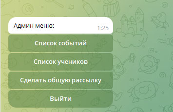

# Инструкция телеграм-бота "bot_class_events".
## Краткое описание:
Сидишь в родительском школьном чате??
Устал листать и искать на что снова собирают деньги из-за флуда остальных?
Выход есть. Выйди из чата и живи спокойно... ))

Данный чат-бот позволяет избавиться это данной проблемы. Администратор группы
(самый активный родитель) создаёт событие, его описание. И сразу же
остальные получают уведомление, они так же имеют возможность принять
участие или отказать.

### Запуск на Windows (при установленном python):
Открываем терминал, переходим в корневую папку с ботом
1. Создаём окружение ```python -m venv venv```
2. Активируем окружение ```venv\Scripts\activate.bat```
3. Устанавливаем зависимости ```FOR /F %x IN (requirements.txt) DO ( IF NOT # == %x ( pip install %x ) )```
4. Переименовываем файл .env.template в .env . Заполняем поле токен-бота. Логин и пароль аднимистратора
5. Запускаем командой из терминала ```python main.py```

### Запуск на Linux (при установленном python):
Открываем терминал, переходим в корневую папку с ботом
1. Создаём окружение ```python3 -m venv venv```   
2. Активируем окружение source ```source venv/bin/activate```
3. Устанавливаем зависимости ```pip install -r requirements.txt```
4. Переименовываем файл .env.template в .env . Заполняем поле токен-бота. Логин и пароль аднимистратора.
5. Запускаем командой из терминала ```python3 main.py```

### Запуск через Docker-compose:
Открываем терминал, переходим в корневую папку с ботом
1. Создаём образ командой ```docker-compose build```
2. Поднимаем контейнер ```docker-compose up```


## Инструкция по работе администратором.



"Список событий" - действия с событиями;


```
    "Просмотреть список" - просмотреть полный список событий (краткая информация)
    "Просмотреть детально" - просмотреть детали события, с участниками и их комментариями
    "Создать" - создать новое событие (при добавление события автоматически производится рассылка всем пользователям)
    "Редактировать" - редактировать событие
    "Удалить" - удалить событие
    "Вернуться назад" - вернуться в главное меню
```

"Список учеников" - действия с учениками;


```
    "Просмотреть" - просмотреть список учеников (с последнней активностью)
    "Создать" - создать ученика (при добавлении ученика генерируется уникальный пароль, его следует сообщить пользователю)
    "Редактировать" - редактировать ученика (изменить ФИ)
    "Изменить пароль" - изменить пароль ученика для входа
    "Удалить" - удалить ученика
    "Заблокироть/разблокировать" - Заблокироть/разблокировать ученика
    "Вернуться назад" - вернуться в главное меню
```
    
"Сделать общую рассылку" - производит массовую рассылку пользователям;

"Выйти" - выйти из-под Администратора


## Инструкция по работе клиентом.
1. Вводите ФИ
2. Вводите пароль (который сообщил администратор)
3. Появляется список событий (кнопками, выбрать интересующее)
4. Кнопка "Принять участие" - принимаете участие в событие и по желанию, оставляете комментарий
5. Кнопка "Отказаться от участия" - отказываетесь от участия
6. Кнопка "Вернуться назад" - возвращает к списку событий
7. В конце списка, кнопка "Выйти" - выходите из-под данного ученика


